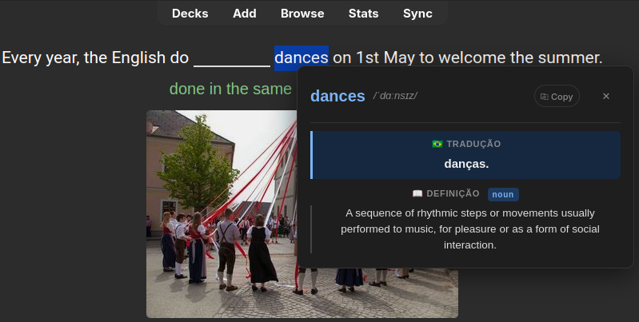
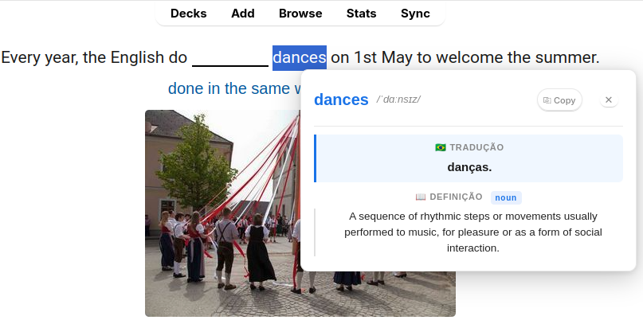

# 📖 English Pop-up Dictionary for Anki

An Anki add-on that shows an instant dictionary popup when you select any English word while reviewing cards — with
translation to Brazilian Portuguese, phonetic transcription, audio pronunciation, definitions, and synonyms.


---

## ✨ Features

- 🇧🇷 **Translation** — English → Portuguese (BR) via MyMemory API
- 📖 **Definitions** — part of speech, meaning, and usage examples
- 🔊 **Audio pronunciation** — native speaker audio playback
- 📝 **Phonetic transcription** — IPA notation
- 🔗 **Synonym chips** — clickable, each one triggers a new lookup
- ⚡ **Local cache** — repeated lookups are instant and work offline
- 🌙 **Dark mode** — adapts automatically to Anki's night mode
- 🖱️ **Right-click menu** — "Look up in English Dictionary..." when text is selected
- 🔍 **Works in Previewer** — not just the reviewer

---

## 🚀 How It Works

Select any English word or phrase on your card (double-click or drag) and a popup appears near your cursor.

```
Card text → user selects a word → JS sends pycmd → Python fetches API + cache → HTML returned → popup rendered
```

The add-on hooks into Anki's reviewer via `webview_will_set_content` and `webview_did_receive_js_message`, injecting
CSS/JS into every review session and listening for lookup requests from the frontend.

---

## 📦 Installation

### From AnkiWeb

Search for **English Pop-up Dictionary** in Anki's add-on browser, or install via code:

> Tools → Add-ons → Get Add-ons → paste the code

### Manual

1. Clone or download this repository
2. Copy the folder into your Anki add-ons directory:
    - **Windows:** `%APPDATA%\Anki2\addons21\`
    - **macOS:** `~/Library/Application Support/Anki2/addons21/`
    - **Linux:** `~/.local/share/Anki2/addons21/`
3. Restart Anki

---

## 🗂️ Project Structure

```
quickdict-english/
├── __init__.py           # Entry point — wires up web and reviewer hooks
├── dictionary.py         # Orchestrates cache, APIs, and HTML generation
├── reviewer.py           # Hooks into Anki's reviewer (JS ↔ Python bridge)
├── web.py                # Registers web assets and injects them into Anki
├── cache.json            # Auto-generated local cache (up to 500 entries)
│
├── core/
│   ├── api.py            # Fetches data from Free Dictionary API and MyMemory
│   ├── cache_mgr.py      # Thread-safe local disk cache management
│   └── html_builder.py   # Builds the tooltip HTML from API data
│
└── web/
    ├── css/
    │   ├── tokens.css    # Design tokens (colors, spacing, typography)
    │   ├── layout.css    # Tooltip shell and structural layout
    │   └── components.css# All UI components (buttons, chips, states)
    └── js/
        ├── ui.js         # Tooltip rendering, positioning, and interactions
        └── events.js     # Mouse event handling and pycmd bridge
```

---

## 🔌 APIs Used

| API                                               | Purpose                                    | Cost |
|---------------------------------------------------|--------------------------------------------|------|
| [Free Dictionary API](https://dictionaryapi.dev/) | Definitions, phonetics, examples, synonyms | Free |
| [MyMemory](https://mymemory.translated.net/)      | English → Portuguese (BR) translation      | Free |

No API key or account required.

---

## ⚙️ Configuration

There are no settings UI yet. You can tweak constants directly in the source:

| File                | Constant    | Default | Description                      |
|---------------------|-------------|---------|----------------------------------|
| `core/cache_mgr.py` | `CACHE_MAX` | `500`   | Maximum number of cached entries |
| `core/api.py`       | `timeout`   | `5`     | HTTP request timeout in seconds  |

---

## 🏗️ Architecture Notes

- **Parallel fetching** — dictionary and translation requests are fired concurrently via `ThreadPoolExecutor`
- **Cache-first** — every lookup checks the local cache before hitting the network
- **Thread-safe cache** — writes are protected by a `threading.Lock`
- **LRU eviction** — when the cache exceeds `CACHE_MAX`, the oldest entries (by timestamp) are removed
- **No external dependencies** — uses only Python's standard library and Anki's bundled Qt

---

## 🤝 Contributing

Contributions are welcome! Feel free to open an issue or submit a pull request.

Some ideas for future improvements:

- Settings UI (target language, max definitions)
- Support for other translation languages
- Morphological normalization (look up base form of conjugated verbs)
- Anki card creation from popup

---

## 📜 License

This project is licensed under the `GNU Affero General Public License v3.0 (AGPL-3.0)`. In short: you’re free to use,
study, and modify this code—but if you run it as a service or distribute modified versions, you must make your source
available under the same license.

I’ve put a lot of time into designing and maintaining this work. Please respect the license and my effort:

- You may use this project commercially, but any modifications or services using it must also be open source under the
  same license.
- If you build on it, please provide proper attribution.

Copyright (C) 2026 Paulo Vitor Silva Soares

---

## This is QuicKDict English




---

### If you find this add-on useful, consider supporting its development:

<a href="https://buymeacoffee.com/pvss">
  
</a>